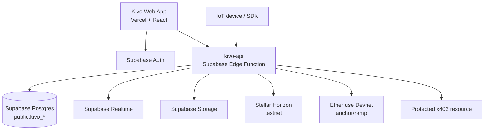
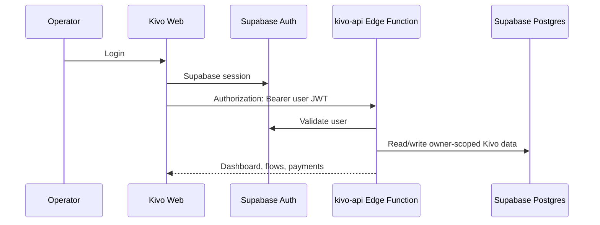
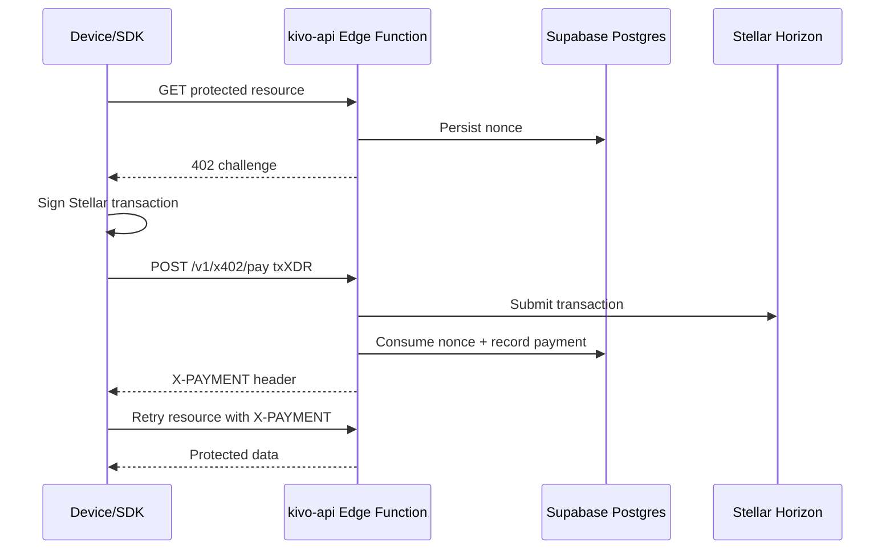
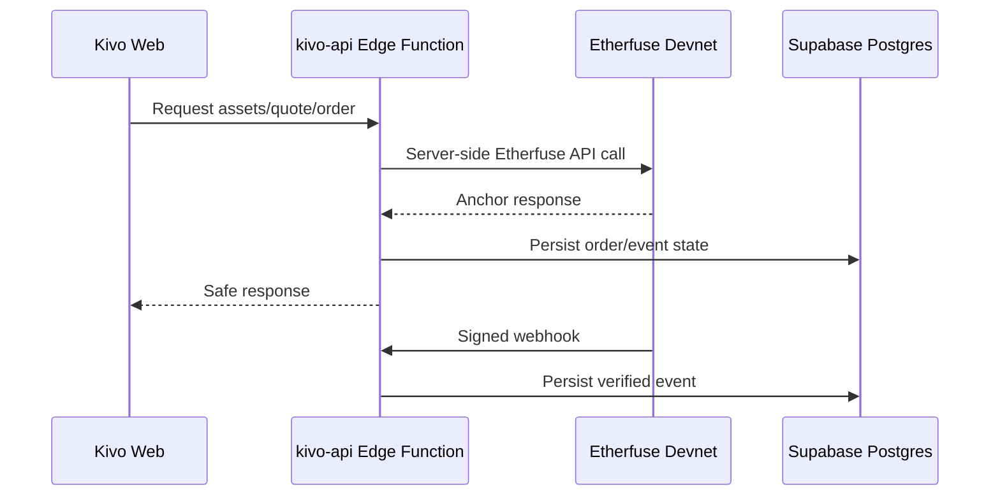

# Architecture

Kivo's MVP architecture is now centered on Supabase and Vercel. Fly.io was removed from the delivery path so the product can ship without an extra paid runtime.

## Runtime Roles

| Runtime | Responsibility |
|---|---|
| Vercel | Serves the Kivo frontend. Contains only public Vite env vars. |
| Supabase Edge Function | Owns REST endpoints, x402, Stellar submission, Etherfuse proxy/webhook, and server-side secrets. |
| Supabase Postgres | Stores devices, payments, x402 nonces, pricing rules, API keys, webhooks, Etherfuse orders, and audit events. |
| Supabase Auth | Authenticates dashboard users. Edge Functions validate the user token before private routes. |
| Supabase Realtime | Pushes operational updates to the dashboard. |
| Supabase Storage | Stores proofs and device assets with private bucket policies. |
| Stellar Horizon | Receives signed Stellar transactions and provides settlement status. |
| Etherfuse Devnet | Provides anchor/ramp flows around Stellar testnet liquidity. |

## Backend Decision

The previous Go backend remains in the repository as a temporary local fallback. It should not be treated as the production runtime for the MVP anymore.

The MVP backend target is TypeScript on Supabase Edge Functions because:

- The team already uses Supabase Auth, Postgres, Realtime, Storage, and Edge Function secrets.
- It removes Fly.io billing and deployment friction.
- Frontend and backend can share TypeScript contracts faster during the two-week delivery window.
- Etherfuse webhooks and x402 routes can live close to the database and secrets.

Go can return later if Kivo needs a high-throughput dedicated gateway, but not before the MVP proves the customer-facing product flow.

## Request Flow

### Human Operator

### x402 Payment

### Etherfuse Anchor

## Security Boundaries

- Browser receives only `VITE_SUPABASE_URL`, `VITE_SUPABASE_PUBLISHABLE_KEY`, and `VITE_KIVO_API_URL`.
- Supabase service role, Etherfuse API key, Etherfuse webhook secret, and Stellar secret keys stay only in server-side runtime secrets.
- `verify_jwt` is disabled on the unified Edge Function because public x402 and Etherfuse webhook routes need to reach the handler. The handler must enforce route-level auth.
- RLS remains enabled on all dashboard-facing `public.kivo_*` tables.
- x402 nonces must be persisted and consumed once.
- Webhook signature verification must use the base64-decoded Etherfuse webhook secret.

## Migration Boundary

Active Edge Function routes:

- deploy readiness
- health
- Etherfuse status/proxy/webhook

Routes still moving from the temporary Go fallback:

- dashboard summary
- devices
- payments
- x402 pay/unlock
- webhooks
- API keys
- MCP tools

Once those are complete and verified, the Go backend can be deleted from `apps/kivo`.
