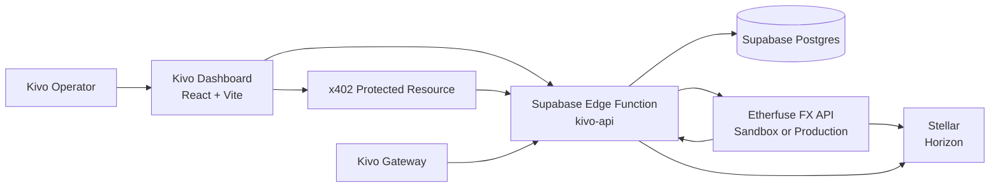

# Etherfuse Integration

Etherfuse is Kivo's visible anchor/funding rail. It helps operators fund or reconcile Stellar assets used by Kivo x402 and Gateway flows. Etherfuse does not replace x402, does not unlock hardware, and does not replace Kivo Gateway authorization.

The current Kivo integration runs through the Supabase Edge Function `kivo-api`, which proxies Etherfuse requests server-side so browser clients never receive `ETHERFUSE_API_KEY`.

**Last verified:** 2026-05-16 against the public Etherfuse docs.

---

## Runtime Architecture



Historical Go/Fiber and Redis queue diagrams are retired for the current MVP. Future worker infrastructure may be added if durable background processing is needed.

---

## Scope

### Current MVP Scope

- Etherfuse sandbox/devnet base URL support.
- Auth with `Authorization: <api-key>` directly, with no `Bearer` prefix.
- Server-side proxy from `kivo-api`.
- Stellar testnet as the hackathon blockchain target.
- Hosted onboarding URL generation.
- Rampable asset discovery.
- Quote creation.
- Order creation.
- Sandbox fiat-received simulation.
- Signed webhook ingestion.
- Order polling fallback for dashboard refresh.
- x402 funding visibility in Kivo health/status surfaces.

### Later Production Scope

- Production base URL: `https://api.etherfuse.com`
- Real KYC/compliance review.
- Real fiat movement.
- Production webhook secret rotation.
- Reconciliation exports.
- Operational alerting on stuck orders.

---

## Current Kivo Edge Routes

| Kivo route | Auth | Etherfuse target / purpose |
|---|---|---|
| `GET /v1/etherfuse/status` | Dashboard JWT | Show local Edge configuration |
| `POST /v1/etherfuse/onboarding-url` | Dashboard JWT | Proxy `POST /ramp/onboarding-url` |
| `GET /v1/etherfuse/assets` | Dashboard JWT | Proxy rampable asset discovery |
| `POST /v1/etherfuse/quotes` | Dashboard JWT | Proxy quote creation |
| `POST /v1/etherfuse/orders` | Dashboard JWT | Proxy order creation |
| `GET /v1/etherfuse/orders/:id` | Dashboard JWT | Poll order state |
| `POST /v1/etherfuse/orders/:id/fiat-received` | Dashboard JWT, sandbox/devnet only | Trigger sandbox fiat-received simulation |
| `POST /v1/etherfuse/webhook` | `X-Signature` | Receive provider webhook events |

Use `/fiat-received` in Kivo docs for the current Edge route. Older `/simulate-fiat-received` names are stale.

---

## Required Edge Secrets

```txt
ETHERFUSE_MODE=devnet
ETHERFUSE_BASE_URL=https://api.sand.etherfuse.com
ETHERFUSE_API_KEY=...
ETHERFUSE_WEBHOOK_URL=https://<project-ref>.supabase.co/functions/v1/kivo-api/v1/etherfuse/webhook
ETHERFUSE_WEBHOOK_SECRET=...
ETHERFUSE_WEBHOOK_VERIFY=true
ETHERFUSE_DEFAULT_FIAT=MXN
ETHERFUSE_ALLOWED_ASSETS=USDC:GBBD47IF6LWK7P7MDEVSCWR7DPUWV3NY3DTQEVFL4NAT4AQH3ZLLFLA5
STELLAR_NETWORK=testnet
STELLAR_HORIZON_URL=https://horizon-testnet.stellar.org
```

The public Etherfuse docs currently use `MXN` examples for the fiat side. Kivo can present other fiat rails in product copy only when the connected Etherfuse account exposes the required country and asset configuration.

---

## Demo Flow

```txt
Etherfuse sandbox onramp
-> Stellar testnet asset visibility
-> Kivo x402 payment
-> Kivo authorization
-> Gateway release
-> dashboard receipt/status
```

Power Totem remains the functional hackathon template. Etherfuse proves funding/anchor context; Kivo Gateway proves access control.

---

## Webhook Verification

Etherfuse webhooks include `X-Signature`. Kivo should:

1. Keep the webhook secret in Supabase Edge Function secrets.
2. Verify signatures when `ETHERFUSE_WEBHOOK_VERIFY=true`.
3. Store provider events for audit and reconciliation.
4. Return a 2xx response only after the event is safely accepted.

Local or sandbox demos may temporarily run with verification disabled, but production must not.

---

## Security Rules

1. Never expose `ETHERFUSE_API_KEY` to the browser.
2. Never log raw API keys or webhook secrets.
3. Validate Stellar public keys before sending them to Etherfuse.
4. Enforce ownership before showing order details.
5. Treat sandbox fiat-received simulation as non-production only.
6. For offramps, require explicit operator approval before signing or submitting a transaction.
7. Keep Etherfuse status separate from Gateway authorization; funding visibility is not access authorization.

---

## Notes From Existing Repo

The SocialPay app contains useful Etherfuse references:

- `apps/socialpay/lib/etherfuse.service.ts`
- `apps/socialpay/app/api/ramp/quote/route.ts`
- `apps/socialpay/app/api/ramp/order/route.ts`
- `apps/socialpay/app/api/webhooks/etherfuse/route.ts`

Reuse operational lessons from those files, especially the direct `Authorization: <api-key>` header and stable customer identifiers. Do not copy Next.js route code into Kivo as current runtime; Kivo's active backend path is the Supabase Edge Function `kivo-api`.
